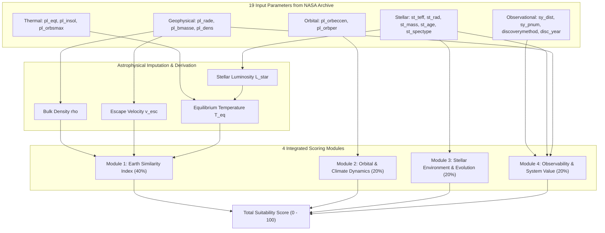

# ESI-Based Exoplanet Suitability Engine Specification (v2)

This document provides a comprehensive technical specification for the **Second-Generation (v2) Exoplanet Suitability Engine**, centered around the academic benchmark **Earth Similarity Index (ESI)** and designed to utilize all 19 observational data parameters fetched from the NASA Exoplanet Archive.

---

## 1. System Architecture & Design Philosophy

The v2 engine addresses the limitations of previous step-function heuristics (discrete cutoff cliffs and isolated metrics) based on three guiding principles:

1. **Continuous Functions**: Utilizing exponential decay functions and weighted geometric means to smoothly grade suitability according to distance from ideal Earth/habitable benchmarks.
2. **Physics-Based Data Imputation & Derivation**: Leveraging fundamental astrophysical laws to compute missing parameters (e.g., density from mass/radius, stellar luminosity, and equilibrium temperature).
3. **Comprehensive Multi-Parameter Integration**: Unifying all 19 observational parameters across planetary geophysics, atmospheric retention, orbital mechanics, stellar evolution, and observational feasibility into 4 modular scores.



---

## 2. Parameter Reference Table (19 Parameters)

| Column            | Physical Meaning        | Unit                  | Primary Module / Role                                            |
| :---------------- | :---------------------- | :-------------------- | :--------------------------------------------------------------- |
| `pl_name`         | Planet Name             | -                     | Unique Identifier                                                |
| `hostname`        | Host Star Name          | -                     | System Identifier                                                |
| `discoverymethod` | Discovery Technique     | -                     | Observational Context & Bias Assessment                          |
| `disc_year`       | Discovery Year          | Year                  | System Metadata                                                  |
| `pl_rade`         | Planet Radius           | Earth Radii (R_Earth) | Interior ESI, Transit Depth, Density/Escape Velocity derivation  |
| `pl_bmasse`       | Planet Mass             | Earth Mass (M_Earth)  | Density, Surface Gravity, Escape Velocity (Atmosphere retention) |
| `pl_dens`         | Planet Density          | g/cm^3                | Interior ESI (Composition: rocky vs gaseous)                     |
| `pl_eqt`          | Equilibrium Temperature | Kelvin (K)            | Surface ESI (Liquid water thermal regime)                        |
| `pl_insol`        | Insolation Flux         | Earth Flux (S_Earth)  | Surface ESI & Thermal fallback derivation                        |
| `pl_orbsmax`      | Semi-Major Axis         | AU                    | Flux & Equilibrium Temperature physical computation              |
| `pl_orbper`       | Orbital Period          | Days                  | Tidal Locking & climate bifurcation assessment                   |
| `pl_orbeccen`     | Orbital Eccentricity    | - (0 to 1)            | Annual flux variation & climate stability penalty                |
| `st_spectype`     | Stellar Spectral Type   | -                     | Flare risk & UV radiation environment                            |
| `st_teff`         | Stellar Effective Temp  | Kelvin (K)            | Stellar Luminosity & Spectral Suitability                        |
| `st_rad`          | Stellar Radius          | Solar Radii (R_Sun)   | Luminosity & Transit Spectroscopy Signal-to-Noise                |
| `st_mass`         | Stellar Mass            | Solar Mass (M_Sun)    | Stellar Main-Sequence Lifetime calculation                       |
| `st_age`          | Stellar Age             | Billion Years (Gyr)   | Evolutionary window for biogenesis                               |
| `sy_dist`         | Distance from Earth     | Parsec (pc)           | Observational Feasibility (Exponential decay)                    |
| `sy_pnum`         | Number of Planets       | Count                 | Comparative planetology & system science bonus                   |

---

## 3. Astrophysical Imputation & Parameter Derivation

When raw values are missing in the archive, values are imputed using fundamental physical relations:

### (1) Stellar Luminosity L_star (Solar Luminosity Ratio)

Derived from the Stefan-Boltzmann law:

```
L_star / L_Sun = (R_star / R_Sun)^2 * (T_eff / 5778 K)^4
```

### (2) Planet Density rho and Relative Escape Velocity v_esc

- **Bulk Density rho (g/cm^3)**:

```
rho = 5.51 * (M / M_Earth) / (R / R_Earth)^3
```

_(If mass is unmeasured and R <= 1.5 R_Earth, the empirical relation M ~= R^3.45 [Chen & Kipping 2017] is used as fallback)._

- **Relative Escape Velocity v_esc (Relative to Earth = 1.0)**:

```
v_esc_rel = sqrt((M / M_Earth) / (R / R_Earth))
```

### (3) Insolation Flux S and Equilibrium Temperature T_eq

Derived from orbital separation a (AU) and stellar luminosity L_star:

```
S / S_Earth = (L_star / L_Sun) / (a / 1 AU)^2
```

Assuming an Earth-like Bond albedo (A = 0.3):

```
T_eq = 255 K * (S / S_Earth)^(1/4)
```

---

## 4. Formulation of the 4 Scoring Modules

### Module 1: Earth Similarity Index (ESI) [Weight: 40%]

Based on the formulation by Schulze-Makuch et al. (2011).

#### Individual Parameter Similarity:

```
ESI_x = (1 - |x - x_0| / (x + x_0))^w
```

| Parameter x                 | Earth Reference x_0 | Weight w     | Physical Rationale                          |
| :-------------------------- | :------------------ | :----------- | :------------------------------------------ |
| **Mean Radius (R)**         | 1.0 R_Earth         | w_R = 0.57   | Structural division (Rocky vs Mini-Neptune) |
| **Bulk Density (rho)**      | 5.51 g/cm^3         | w_rho = 1.07 | Core/mantle geochemical composition         |
| **Escape Velocity (v_esc)** | 1.0 v_esc,Earth     | w_v = 0.70   | Volatile & atmospheric retention capacity   |
| **Equilibrium Temp (T_eq)** | 255 K               | w_T = 5.58   | Liquid water boundary (highest weighting)   |

#### Global ESI Formulation:

- **Interior ESI**:

```
ESI_interior = ( (ESI_R ^ w_R) * (ESI_rho ^ w_rho) ) ^ (1 / (w_R + w_rho))
```

- **Surface ESI**:

```
ESI_surface = ( (ESI_v ^ w_v) * (ESI_T ^ w_T) ) ^ (1 / (w_v + w_T))
```

- **Global ESI (0.00 to 1.00)**:

```
ESI_global = ( (ESI_R ^ w_R) * (ESI_rho ^ w_rho) * (ESI_v ^ w_v) * (ESI_T ^ w_T) ) ^ (1 / (w_R + w_rho + w_v + w_T))
```

```
score_esi = ESI_global * 100
```

---

### Module 2: Orbital & Climate Dynamics (score_orbit) [Weight: 20%]

1. **Eccentricity Penalty (S_ecc)**:
   Eccentric orbits induce extreme seasonal temperature fluctuations and increase annual average insolation (<F> = F_0 / sqrt(1 - e^2)). Modeled via Gaussian decay:

```
S_ecc = exp(-4.0 * e^2)
```

- e = 0.00 -> 1.00 (Ideal circular orbit)
- e = 0.10 -> 0.96
- e = 0.25 -> 0.78
- e = 0.50 -> 0.37

2. **Tidal Locking Penalty (P_tidal)**:
   Ultra-short orbital periods (P_orb) around low-mass stars indicate synchronous rotation (permanent day/night hemispheres), risking atmospheric collapse or extreme temperature contrast:

```
P_tidal = 0.75  if P_orb < 5 days
P_tidal = 0.90  if 5 days <= P_orb < 15 days
P_tidal = 1.00  if P_orb >= 15 days (or unknown)
```

```
score_orbit = S_ecc * P_tidal * 100
```

---

### Module 3: Stellar Environment & Evolution (score_star) [Weight: 20%]

Evaluates host star radiation quality, flare activity, and sufficient evolutionary window for complex life.

1. **Stellar Effective Temperature / Spectral Type Score (S_teff)**:
   - **K-Dwarfs (Orange Dwarfs, 3900 to 5300 K)**: **100 pts** (_"Goldilocks Stars"_: extremely long lifetimes, low coronal flare activity).
   - **G-Dwarfs (Solar-type, 5300 to 6000 K)**: **95 pts** (Proven host for complex life).
   - **M-Dwarfs (Red Dwarfs, < 3900 K)**: **65 pts** (High superflare frequency, high XUV atmospheric stripping risk).
   - **F-Dwarfs (6000 to 7000 K)**: **40 pts** (Elevated UV radiation, shorter main-sequence lifespan).
   - **Hot Stars (> 7000 K)**: **10 pts** (Lifespan < 1 Gyr, insufficient for biogenesis).

2. **Stellar Age vs. Main-Sequence Lifespan (S_age)**:
   Main-sequence lifetime estimation:

```
t_ms ~= 10.0 * (M_star / M_Sun)^(-2.5)  [Gyr]
```

- **Age < 1.0 Gyr**: **40 pts** (Violent early stellar youth / flare-saturated).
- **1.5 Gyr <= Age <= min(8.0 Gyr, 0.8 \* t_ms)**: **100 pts** (Stable mature window for biological evolution).
- **Age > t_ms**: **20 pts** (Post-main-sequence / Red giant phase).
- Missing / Other: **70 to 80 pts**.

```
score_star = (S_teff * 0.60) + (S_age * 0.40)
```

---

### Module 4: Observability & System Value (score_obs) [Weight: 20%]

Evaluates atmospheric characterization feasibility with current/next-gen observatories (JWST, ELT, HWO).

1. **Distance Attenuation (S_dist)**:
   Exponential decay based on distance d in parsecs (pc):

```
S_dist = exp(-d / 50 pc) * 100
```

- 10 pc -> 81.9 pts
- 20 pc -> 67.0 pts
- 50 pc -> 36.8 pts
- 100 pc -> 13.5 pts

2. **Transit Transmission Signal Factor (B_transit)**:
   Transmission spectroscopy SNR scales with transit depth delta = (R_p / R_star)^2:

```
delta = ((R_p * 0.009167) / R_star)^2
```

- If delta > 0.0005: B_transit = 1.15 (+15% atmospheric detectability boost).
- Otherwise: B_transit = 1.00.

3. **Multi-Planet System Bonus (B_multi)**:
   Bonus for comparative planetology and dynamical system research based on total planet count N_p (`sy_pnum`):

```
B_multi = 1.0 + min(max(N_p - 1, 0) * 0.05, 0.20)
```

```
score_obs = min(S_dist * B_transit * B_multi, 100.0)
```

---

## 5. Total Suitability Score Formulation

The final unified suitability score (0.00 to 100.00) is calculated as:

```
Total Score = (score_esi * 0.40) + (score_orbit * 0.20) + (score_star * 0.20) + (score_obs * 0.20)
```

### Ranking & Output Sorting:

1. `total_score` in **Descending** order (highest-priority candidates at the top).
2. `sy_dist` in **Ascending** order (nearest systems break ties).
