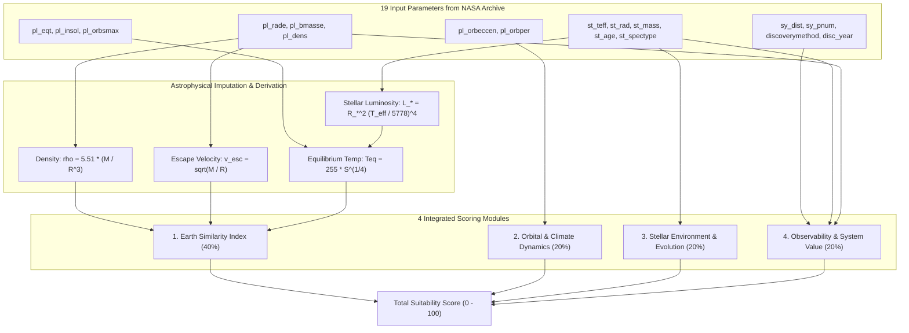

# ESI-Based Exoplanet Suitability Engine Specification (v2)

This document provides a comprehensive technical specification for the **Second-Generation (v2) Exoplanet Suitability Engine**, centered around the academic benchmark **Earth Similarity Index (ESI)** and designed to utilize all 19 observational data parameters fetched from the NASA Exoplanet Archive.

---

## 1. System Architecture & Design Philosophy

The v2 engine addresses the limitations of previous step-function heuristics (discrete cutoff cliffs and isolated metrics) based on three guiding principles:

1. **Continuous Functions**: Utilizing Gaussian models, exponential decay functions, and weighted geometric means to smoothly grade suitability according to distance from ideal Earth/habitable benchmarks.
2. **Physics-Based Data Imputation & Derivation**: Leveraging fundamental astrophysical laws to compute missing parameters (e.g., density from mass/radius, stellar luminosity, and equilibrium temperature).
3. **Comprehensive Multi-Parameter Integration**: Unifying all 19 observational parameters across planetary geophysics, atmospheric retention, orbital mechanics, stellar evolution, and observational feasibility into 4 modular scores.

---

## 2. Parameter Reference Table (19 Parameters)

| Column            | Physical Meaning        | Unit                         | Primary Module / Role                                            |
| :---------------- | :---------------------- | :--------------------------- | :--------------------------------------------------------------- |
| `pl_name`         | Planet Name             | -                            | Unique Identifier                                                |
| `hostname`        | Host Star Name          | -                            | Identifier                                                       |
| `discoverymethod` | Discovery Technique     | -                            | Observational Context & Bias Assessment                          |
| `disc_year`       | Discovery Year          | Year                         | System Metadata                                                  |
| `pl_rade`         | Planet Radius           | Earth Radii ($R_\oplus$)     | Interior ESI, Transit Depth, Density/Escape Velocity derivation  |
| `pl_bmasse`       | Planet Mass             | Earth Mass ($M_\oplus$)      | Density, Surface Gravity, Escape Velocity (Atmosphere retention) |
| `pl_dens`         | Planet Density          | $\text{g/cm}^3$              | Interior ESI (Composition: rocky vs gaseous)                     |
| `pl_eqt`          | Equilibrium Temperature | $\text{K}$                   | Surface ESI (Liquid water thermal regime)                        |
| `pl_insol`        | Insolation Flux         | Earth Flux ($S_\oplus$)      | Surface ESI & Thermal fallback derivation                        |
| `pl_orbsmax`      | Semi-Major Axis         | $\text{AU}$                  | Flux & Equilibrium Temperature physical computation              |
| `pl_orbper`       | Orbital Period          | Days                         | Tidal Locking & climate bifurcation assessment                   |
| `pl_orbeccen`     | Orbital Eccentricity    | - ($0 \le e < 1$)            | Annual flux variation & climate stability penalty                |
| `st_spectype`     | Stellar Spectral Type   | -                            | Flare risk & UV radiation environment                            |
| `st_teff`         | Stellar Effective Temp  | $\text{K}$                   | Stellar Luminosity & Spectral Suitability                        |
| `st_rad`          | Stellar Radius          | Solar Radii ($R_\odot$)      | Luminosity & Transit Atmospheric Spectroscopy Signal-to-Noise    |
| `st_mass`         | Stellar Mass            | Solar Mass ($M_\odot$)       | Stellar Main-Sequence Lifetime ($t_{\text{ms}}$)                 |
| `st_age`          | Stellar Age             | Billion Years ($\text{Gyr}$) | Evolutionary window for biogenesis                               |
| `sy_dist`         | Distance from Earth     | Parsec ($\text{pc}$)         | Observational Feasibility (Exponential decay)                    |
| `sy_pnum`         | Number of Planets       | Count                        | Comparative planetology & system science bonus                   |

---

## 3. Astrophysical Imputation & Parameter Derivation

When raw values are missing in the archive, values are imputed using fundamental physical relations:

### (1) Stellar Luminosity $L_*$ (Solar Luminosity Ratio)

Derived from the Stefan-Boltzmann law:
$$L_* = \left(\frac{R_*}{R_\odot}\right)^2 \left(\frac{T_{\text{eff}}}{5778\,\text{K}}\right)^4$$

### (2) Planet Density $\rho$ & Relative Escape Velocity $v_{\text{esc}}$

- **Bulk Density $\rho$** ($\text{g/cm}^3$):
  $$\rho = \rho_\oplus \frac{M / M_\oplus}{(R / R_\oplus)^3} = 5.51 \times \frac{M}{R^3}$$
  _(If mass is unmeasured and $R \le 1.5 R_\oplus$, empirical Mass-Radius relation $M \approx R^{3.45}$ [Chen & Kipping 2017] is used as fallback).\_
- **Relative Escape Velocity $v_{\text{esc, rel}}$** (Relative to Earth):
  $$v_{\text{esc, rel}} = \sqrt{\frac{M / M_\oplus}{R / R_\oplus}}$$

### (3) Insolation Flux $S$ & Equilibrium Temperature $T_{\text{eq}}$

Derived from orbital separation $a$ and stellar luminosity $L_*$:
$$S = \frac{L_*}{(a / 1\,\text{AU})^2}$$
Assuming an Earth-like Bond albedo ($A = 0.3$):
$$T_{\text{eq}} = 255 \times S^{1/4} \quad (\text{K})$$

---

## 4. Formulation of the 4 Scoring Modules

### Module 1: Earth Similarity Index (ESI) 【Weight: 40%】

Based on the formulation by Schulze-Makuch et al. (2011).

#### Individual Parameter Similarity:

$$ESI_x = \left( 1 - \left| \frac{x - x_0}{x + x_0} \right| \right)^w$$

| Parameter $x$                        | Earth Reference $x_0$          | Weight $w$      | Physical Rationale                          |
| :----------------------------------- | :----------------------------- | :-------------- | :------------------------------------------ |
| **Mean Radius** $R$                  | $1.0 \, R_\oplus$              | $w_R = 0.57$    | Structural division (Rocky vs Mini-Neptune) |
| **Bulk Density** $\rho$              | $5.51 \, \text{g/cm}^3$        | $w_\rho = 1.07$ | Core/mantle geochemical composition         |
| **Escape Velocity** $v_{\text{esc}}$ | $1.0 \, v_{\text{esc},\oplus}$ | $w_v = 0.70$    | Volatile & atmospheric retention capacity   |
| **Equilibrium Temp** $T_{\text{eq}}$ | $255 \, \text{K}$              | $w_T = 5.58$    | Liquid water boundary (highest weighting)   |

#### Global ESI Formulation:

- **Interior ESI**:
  $$ESI_{\text{interior}} = \left( ESI_R^{w_R} \times ESI_\rho^{w_\rho} \right)^{\frac{1}{w_R + w_\rho}}$$
- **Surface ESI**:
  $$ESI_{\text{surface}} = \left( ESI_v^{w_v} \times ESI_T^{w_T} \right)^{\frac{1}{w_v + w_T}}$$
- **Global ESI (0.00 to 1.00)**:
  $$ESI_{\text{global}} = \left( ESI_R^{w_R} \times ESI_\rho^{w_\rho} \times ESI_v^{w_v} \times ESI_T^{w_T} \right)^{\frac{1}{w_R + w_\rho + w_v + w_T}}$$

$$\text{score\_esi} = ESI_{\text{global}} \times 100$$

---

### Module 2: Orbital & Climate Dynamics (`score_orbit`) 【Weight: 20%】

1. **Eccentricity Penalty ($S_{\text{ecc}}$)**:
   Eccentric orbits induce extreme seasonal temperature fluctuations and increase annual average insolation ($\langle F \rangle = F_0 / \sqrt{1 - e^2}$). Modeled via Gaussian decay:
   $$S_{\text{ecc}} = \exp(-4.0 \times e^2)$$
   - $e = 0.00 \rightarrow 1.00$ (Ideal circular orbit)
   - $e = 0.10 \rightarrow 0.96$
   - $e = 0.25 \rightarrow 0.78$
   - $e = 0.50 \rightarrow 0.37$

2. **Tidal Locking Penalty ($P_{\text{tidal}}$)**:
   Ultra-short orbital periods ($P_{\text{orb}}$) around low-mass stars indicate synchronous rotation (permanent day/night hemispheres), risking atmospheric collapse or extreme temperature contrast:
   $$P_{\text{tidal}} = \begin{cases} 0.75 & (P_{\text{orb}} < 5\,\text{days}) \\ 0.90 & (5\,\text{days} \le P_{\text{orb}} < 15\,\text{days}) \\ 1.00 & (P_{\text{orb}} \ge 15\,\text{days} \text{ or unknown}) \end{cases}$$

$$\text{score\_orbit} = S_{\text{ecc}} \times P_{\text{tidal}} \times 100$$

---

### Module 3: Stellar Environment & Evolution (`score_star`) 【Weight: 20%】

Evaluates host star radiation quality, flare activity, and sufficient evolutionary window for complex life.

1. **Stellar Effective Temperature / Spectral Type Score ($S_{\text{teff}}$)**:
   - **K-Dwarfs (Orange Dwarfs, 3900–5300 K)**: **100 pts** (_"Goldilocks Stars"_: extremely long lifetimes, low coronal flare activity).
   - **G-Dwarfs (Solar-type, 5300–6000 K)**: **95 pts** (Proven host for complex life).
   - **M-Dwarfs (Red Dwarfs, < 3900 K)**: **65 pts** (High superflare frequency, high XUV atmospheric stripping risk).
   - **F-Dwarfs (6000–7000 K)**: **40 pts** (Elevated UV radiation, shorter main-sequence lifespan).
   - **Hot Stars (> 7000 K)**: **10 pts** (Lifespan < 1 Gyr, insufficient for biogenesis).

2. **Stellar Age vs. Main-Sequence Lifespan ($S_{\text{age}}$)**:
   Main-sequence lifetime estimation: $t_{\text{ms}} \approx 10.0 \times (M_* / M_\odot)^{-2.5} \, [\text{Gyr}]$
   - **$\text{Age} < 1.0\,\text{Gyr}$**: **40 pts** (Violent early stellar youth / flare-saturated).
   - **$1.5\,\text{Gyr} \le \text{Age} \le \min(8.0\,\text{Gyr}, 0.8 \times t_{\text{ms}})$**: **100 pts** (Stable mature window for biological evolution).
   - **$\text{Age} > t_{\text{ms}}$**: **20 pts** (Post-main-sequence / Red giant phase).
   - Missing/Other: **70–80 pts**.

$$\text{score\_star} = (S_{\text{teff}} \times 0.60) + (S_{\text{age}} \times 0.40)$$

---

### Module 4: Observability & System Value (`score_obs`) 【Weight: 20%】

Evaluates atmospheric characterization feasibility with current/next-gen observatories (JWST, ELT, HWO).

1. **Distance Attenuation ($S_{\text{dist}}$)**:
   Exponential decay based on distance $d$ in parsecs:
   $$S_{\text{dist}} = \exp\left( -\frac{d}{50\,\text{pc}} \right) \times 100$$
   - $10\,\text{pc} \rightarrow 81.9\,\text{pts}$
   - $20\,\text{pc} \rightarrow 67.0\,\text{pts}$
   - $50\,\text{pc} \rightarrow 36.8\,\text{pts}$
   - $100\,\text{pc} \rightarrow 13.5\,\text{pts}$

2. **Transit Transmission Signal Factor ($B_{\text{transit}}$)**:
   Transmission spectroscopy SNR scales with transit depth $\delta = (R_p / R_*)^2$:
   $$\delta = \left(\frac{R_p \times 0.009167}{R_*}\right)^2$$
   - If $\delta > 0.0005$: $B_{\text{transit}} = 1.15$ (+15% atmospheric detectability boost).
   - Otherwise: $B_{\text{transit}} = 1.00$.

3. **Multi-Planet System Bonus ($B_{\text{multi}}$)**:
   Bonus for comparative planetology and dynamical system research based on total planet count $N_p$ (`sy_pnum`):
   $$B_{\text{multi}} = 1.0 + \min(\max(N_p - 1, 0) \times 0.05, 0.20)$$

$$\text{score\_obs} = \min\left( S_{\text{dist}} \times B_{\text{transit}} \times B_{\text{multi}}, \, 100.0 \right)$$

---

## 5. Total Suitability Score Formulation

The final unified suitability score (0.00 to 100.00) is calculated as:

$$\text{Total Score} = (\text{score\_esi} \times 0.40) + (\text{score\_orbit} \times 0.20) + (\text{score\_star} \times 0.20) + (\text{score\_obs} \times 0.20)$$

### Ranking & Output Sorting:

1. `total_score` in **Descending** order (highest-priority candidates at the top).
2. `sy_dist` in **Ascending** order (nearest systems break ties).
